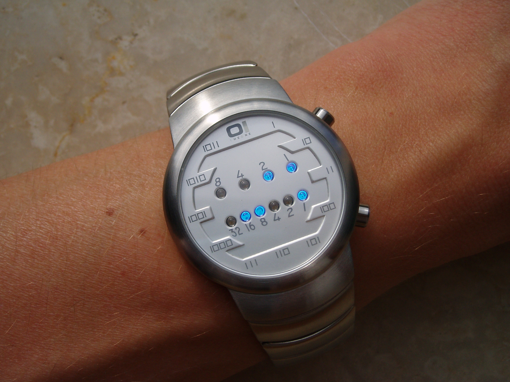

# 401 二进制手表

[leetcode链接](https://leetcode-cn.com/problems/binary-watch/)

tags：`回溯`

## 题目

二进制手表顶部有 4 个 LED 代表 小时（0-11），底部的 6 个 LED 代表 分钟（0-59）。

每个 LED 代表一个 0 或 1，最低位在右侧。



例如，上面的二进制手表读取 “3:25”。

给定一个非负整数 n 代表当前 LED 亮着的数量，返回所有可能的时间。

示例：

```txt
输入: n = 1
返回: ["1:00", "2:00", "4:00", "8:00", "0:01", "0:02", "0:04", "0:08", "0:16", "0:32"]
```

提示：

- 输出的顺序没有要求。
- 小时不会以零开头，比如 “01:00” 是不允许的，应为 “1:00”。
- 分钟必须由两位数组成，可能会以零开头，比如 “10:2” 是无效的，应为 “10:02”。
- 超过表示范围（小时 0-11，分钟 0-59）的数据将会被舍弃，也就是说不会出现 "13:00", "0:61" 等时间。

## 解题思路

```java
class Solution {
  private int[] hours = { 8, 4, 2, 1 };
  
  private int[] minutes = { 32, 16, 8, 4, 2, 1 };

  public List<String> readBinaryWatch(int num) {
    List<String> res = new ArrayList<>();

    for(int i = 0; i <= num; i ++) {
      List<Integer> curHours = generateDigit(hours, i);
      List<Integer> curMinutes = generateDigit(minutes, num - i);
      for(int hour: curHours) {
        if (hour >= 12) continue;
        for(int minute : curMinutes) {
          if (minute >= 60) continue;
          res.add(hour + ":" + (minute < 10 ? "0" + minute : minute));
        }
      }
    }

    return res;
  }

  private List<Integer> generateDigit(int[] nums, int digitCount) {
    List<Integer> ans = new ArrayList();

    doGenerateDigit(nums, digitCount, 0, 0, ans);

    return ans;
  }

  private void doGenerateDigit(int[] nums, int leftCount, int pos, int curDigit, List<Integer> ans) {
    if(leftCount == 0) {
      ans.add(curDigit);
      return;
    }

    for(int i = pos; i < nums.length; i ++) {
      doGenerateDigit(nums, leftCount - 1, i + 1, curDigit + nums[i], ans);
    }
  }
}
```

- 时间复杂度：
- 空间复杂度：
